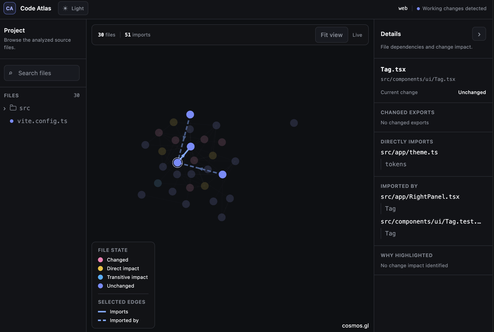

# Code Atlas

Code Atlas is a local dependency and change-impact explorer for JavaScript and
TypeScript projects. It shows how files connect, which exports changed, and
which parts of a project may be affected by the work in progress.



## What it does

- Builds an interactive graph of internal imports and re-exports.
- Shows directional edges so you can follow which file imports which.
- Compares the working tree with Git `HEAD` to identify added, modified,
  deleted, and renamed source files.
- Detects changed exported symbols and traces direct and potential transitive
  impact through the dependency graph.
- Colors files by change state: changed, direct impact, transitive impact, or
  unchanged.
- Provides a searchable, collapsible project file tree.
- Shows a file's path, changed exports, direct imports, importers, imported
  symbols, and impact reasons.
- Keeps project analysis and source code on the local machine.

Code Atlas supports `.js`, `.jsx`, `.ts`, `.tsx`, `.mjs`, `.cjs`, `.mts`, and
`.cts` source files.

## Requirements

- Node.js 22.12 or newer
- A Git repository containing a JavaScript or TypeScript project

## Run Code Atlas

From the root of the project you want to inspect:

```sh
npx @dububu/code-atlas .
```

Code Atlas starts a local server, analyzes the selected project, and opens the
visualizer in the default browser. Pass another directory to inspect a
different project:

```sh
npx @dububu/code-atlas /path/to/project
```

For repeat use, install the command globally:

```sh
npm install --global @dububu/code-atlas
code-atlas /path/to/project
```

Available options:

```text
--port <number>  Local server port (default: 43110)
--no-open        Do not open the browser automatically
-h, --help       Show help
-v, --version    Show the installed version
```

## Reading the graph

Each node represents a source file, and each arrow points from the importing
file to the imported file. Hover a node to see its filename, or select it to
highlight the files and edges directly connected to it.

When a file is selected, solid highlighted edges are imports made by that file
and dashed highlighted edges are files that import it. The details panel lists
the corresponding files and imported symbols.

File colors describe the current Git and impact state:

- **Changed**: the file changed directly in the working tree.
- **Direct impact**: the file directly imports an export that changed.
- **Transitive impact**: the file may be affected through one or more internal
  dependencies.
- **Unchanged**: no current change impact was identified.

Use the file tree to browse directories or search by project-relative path.
Selecting a file there opens the same graph and details view.

## How analysis works

Code Atlas discovers supported source files from the project's TypeScript
configuration, parses module references, and resolves internal dependencies.
It compares exported symbols in the working tree with their versions at Git
`HEAD`, then follows the resulting relationships to calculate direct and
transitive impact.

Confirmed static imports and re-exports are distinguished from relationships
that can only be inferred. Uncertain analysis remains labeled as potential
impact rather than being presented as a guaranteed runtime effect.

## Local development

Install dependencies and start the analyzer and Vite development server:

```sh
npm install
npm run dev
```

By default, the development app analyzes this repository's `web` directory.
Pass a different project path when needed:

```sh
npm run dev -- /absolute/path/to/project
```

To use the disposable sample repository:

```sh
npm run playground
npm run dev -- .playground/sample-project
```

Run the complete validation suite with:

```sh
npm run verify
```

## Privacy and security

Code Atlas binds its server to `127.0.0.1` and rejects non-loopback hosts and
origins. It does not provide an endpoint for raw source contents and does not
upload analyzed source code to a hosted service.

Analysis snapshots contain project-relative paths, import and export metadata,
change classifications, structural hashes, and diagnostics, but not raw source
text.

## License

[MIT](LICENSE)
